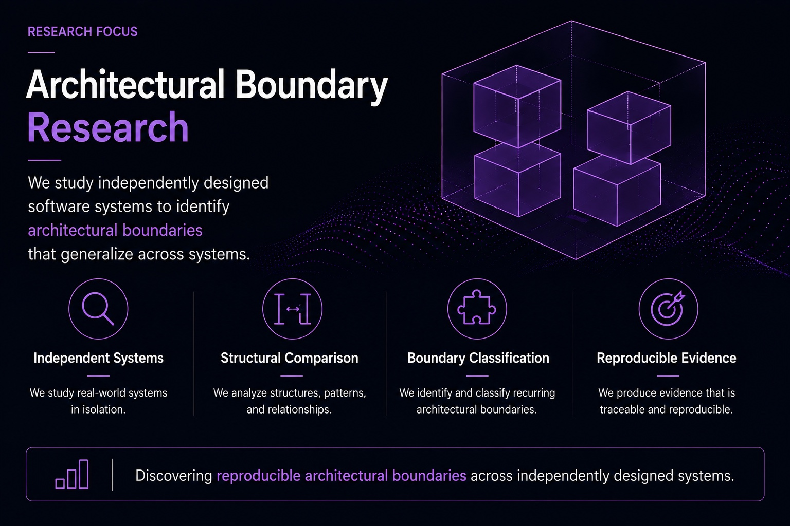
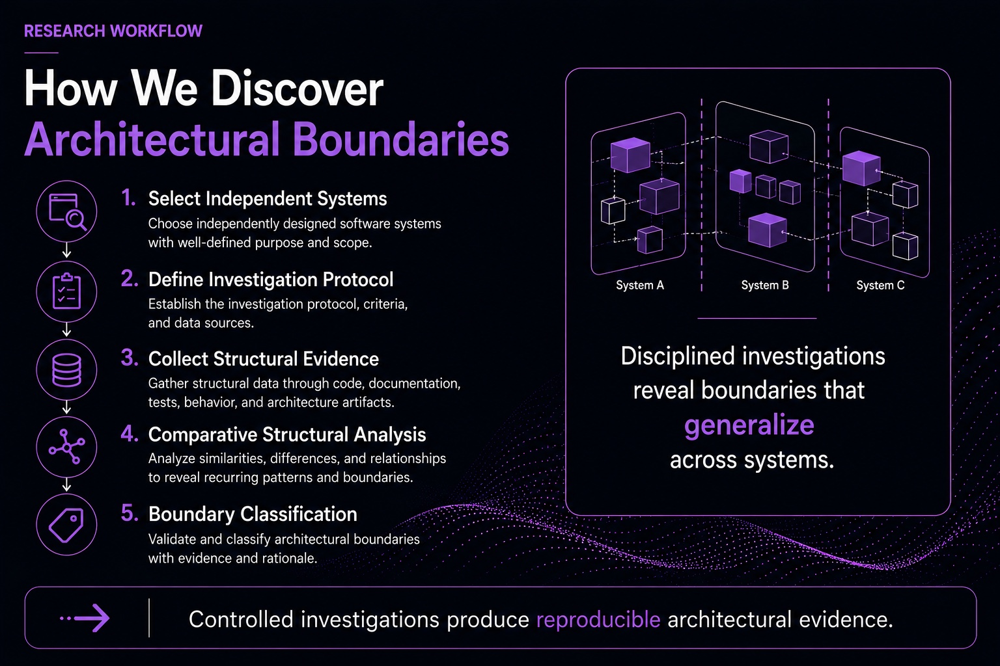
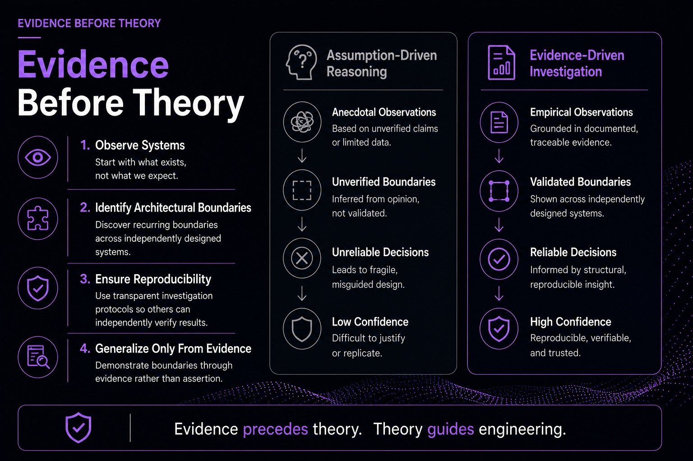
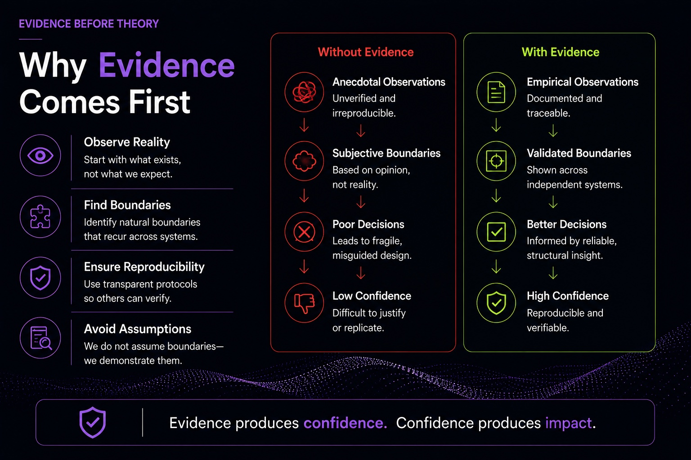
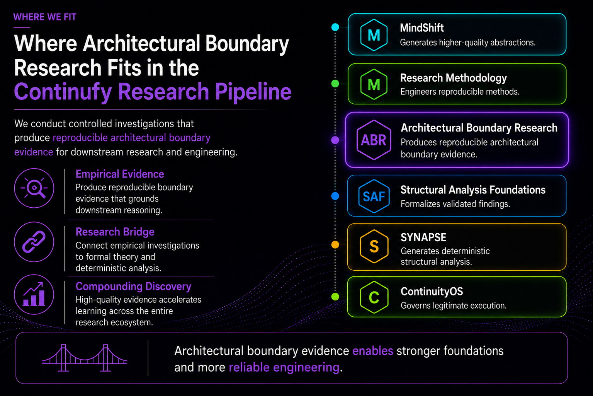

# Architectural Boundary Research

Developing reproducible methods for discovering, evaluating, and validating architectural boundaries across independently designed software systems.

This repository is an empirical research environment for controlled investigations into recurring software structure. It contains the protocols, preregistrations, execution instruments, evidence artifacts, datasets, analyses, and publication outputs needed to turn architectural reasoning into reviewable and reproducible evidence.

The repository is organized around the execution lifecycle of the **Invariance-Based Architectural Investigation Protocol**. The root README is the entry point; the directory topology mirrors how an investigation is registered, executed, validated, analyzed, and prepared for publication.

## Mission

This repository contains the protocol, preregistered investigations, evidence artifacts, comparative datasets, schemas, analysis materials, and publication outputs needed to determine whether proposed architectural boundaries are:

- Architectural invariants
- Conditional invariants
- Domain-specific patterns
- Implementation artifacts
- Unsupported by evidence

## Research Lifecycle

```text
Protocol
  ↓
Investigation
  ↓
BOR
  ↓
SRF
  ↓
DER
  ↓
MSR
  ↓
Comparative Dataset
  ↓
Analysis
  ↓
Retained Classification
  ↓
Canonical Cohort Conclusion
```

Current B2 lifecycle state: BOR, SRF, DER, MSR, Comparative Dataset, Analysis,
Retained Classification, Canonical Cohort Conclusion, and publication-readiness
audit are complete. The canonical cohort outcome is `indeterminate`; publication
readiness does not strengthen that outcome or authorize formalization.

## Reference Execution v1.0 Boundary

This repository is the empirical execution environment that applies frozen
methodologies to bounded investigations of real systems and preserves reviewable
research artifacts. It owns its protocol executions, empirical evidence,
datasets, analyses, retained classifications, cohort conclusions, and
producer-owned promotion packages.

It does not create canonical theory, mutate an upstream methodology or
Structology definition during execution, grant implementation or execution
authority, decide execution legitimacy for another repository, or convert
evidence into formalization authority. The producer/consumer boundary is:

```text
Empirical Evidence
  -> Producer-Owned Promotion Package
  -> Consumer-Owned Admissibility and Promotion Decision
```

The canonical Protocol v1 evidence chain is:

```text
Registration
  -> BOR
  -> SRF
  -> DER
  -> MSR
  -> Comparative Dataset
  -> Analysis
  -> Retained Classification
  -> Canonical Cohort Conclusion
```

Observation, derivation, measurement, analysis, and decision artifacts remain
distinct. A Minimal Promotion Package may reference this chain, but it neither
duplicates the canonical evidence nor performs a downstream decision.

The artifacts under
`investigations/structology-transfer-audit-rehearsal-1/` are a pre-reference
instrument-harness rehearsal only. Its validity is `BLOCKED`, its transfer
outcome is `NOT_REACHED`, and it is not Pilot Execution #1 or a Reference
Execution.

The repository-owned [Reference Execution v1.0 freeze/readiness record](docs/reference-execution/v1.0/freeze-readiness-record.md)
assesses clean `main` commit
`dc636f2ec0161b3554605489857cf19142818a43` and records `BLOCKED`. Issue #106
later materialized a deterministic
[Architectural Investigation Instrument v1 candidate](instrument/architectural-investigation/v1/README.md),
but the [superseding instrument freeze record](docs/reference-execution/v1.0/architectural-investigation-instrument-v1-freeze-record.md)
records `INSTRUMENT_SPECIFICATION_REVISION_REQUIRED`: Issues #59, #77, and #78
were closed without an evidence-bound `IMPLEMENTATION_READY` determination or
complete calibration predicates. Issue #107's
[candidate.2 readiness overlay](instrument/architectural-investigation/v1/candidate-2/README.md)
materializes those general semantics and a controlled fixture, while the
[Issue #107 readiness review](docs/reference-execution/v1.0/architectural-investigation-instrument-v1-readiness-review-issue-107.md)
preserves the remaining independent-calibration and containing-commit blockers.
Its determination remains `INSTRUMENT_SPECIFICATION_REVISION_REQUIRED`. The
blocked Issue #84 package remains `BLOCKED` / `NOT_REACHED`; no substantive
rerun is authorized.

## Repository Organization

| Path | Purpose |
| --- | --- |
| `protocol/` | Versioned definitions of the investigation protocol, protocol figures, schemas, templates, and changelog. |
| `investigations/` | Preregistered executions of the protocol. Each investigation follows the same preregistration → literature → BOR → SRF → DER → MSR → dataset → analysis → artifacts layout. |
| `evidence/` | Cross-investigation evidence stores for observations, measurements, classifications, and traceability material. |
| `datasets/` | Canonical, comparative, and published datasets derived from investigations. |
| `schemas/` | Repository-level JSON schemas for protocol objects and investigation metadata. |
| `analysis/` | Investigation-local analysis lives under each investigation; reusable or cross-investigation analysis should be added through the lifecycle layout before publication. |
| `instrument/` | Versioned repository-owned audit-instrument candidates, manifests, compatibility contracts, and readiness boundaries. Presence does not imply freeze or execution authority. |
| `papers/` | Manuscripts and paper-specific source files, including the migrated B2 manuscript. |
| `registry/` | Machine-readable indexes of investigations, protocol versions, retained classifications, and candidate invariants. |
| `figures/` | Shared figures grouped by protocol, papers, and investigations. |
| `scripts/` | Deterministic helper scripts for validation, build orchestration, publication staging, and registry generation. |
| `validation/` | Validation schemas, reports, and CI-facing validation assets. |
| `releases/` | Publication-oriented release bundles and immutable release notes. |

## Current Content Map

- The B2 LaTeX manuscript was moved from the repository root to `papers/paper-b2/` without rewriting manuscript content.
- `investigations/b1-three-system-pilot/` provides the lifecycle layout for the B1 pilot investigation.
- `investigations/b2-governance-cohort/` provides the lifecycle anchor for the B2 governance cohort.
- `investigations/template/` is the reusable scaffold for future investigations.

## Adding a Future Investigation

1. Copy `investigations/template/` to `investigations/<investigation-id>/`.
2. Complete `preregistration.md` before execution.
3. Record observations in `bor/`, surfaces in `srf/`, derived evidence in `der/`, and measurements in `msr/`.
4. Build investigation-local datasets in `dataset/` and analysis outputs in `analysis/`.
5. Place figures and publication artifacts in `figures/` and `artifacts/`.
6. Register the investigation in `registry/investigations.json`; topology validation automatically discovers every registered workspace and verifies its standard scaffold.
7. Run `python3 scripts/validate.py` before publication or release.

## Scientific Principles

- Preregister before execution.
- Separate observation from interpretation.
- Preserve complete traceability.
- Prefer evidence over intuition.
- Promote only recurring patterns to Candidate Architectural Invariants.
- Treat empirical recurrence and formal proof as separate stages of the research program.

## Publication Build

Reproducible publication builds are driven by `scripts/build_papers.py`. The script discovers every buildable manuscript at `papers/**/main.tex`, compiles each paper independently with `pdflatex` and `bibtex`, reports fatal errors and publication warnings separately, and emits generated PDFs to `releases/papers/`.

Local publication build:

```bash
python3 scripts/build_papers.py
```

Full repository validation, including publication readiness:

```bash
python3 scripts/validate.py
```

New research manuscripts must originate in this repository by copying `papers/_template/` to `papers/<paper-id>/`; Overleaf and other external editors are non-canonical review surfaces only.

See [Publication Build and Release Artifacts](docs/publication.md) for the repository-first authoring workflow, required TeX Live packages, CI behavior, bibliography/reference warning categories, and release artifact locations.

## Architectural Boundary Research Overview

This visual overview summarizes the purpose, workflow, evidence model, and ecosystem position of Architectural Boundary Research.

### Research Focus



### Research Workflow



### Evidence Before Theory



### Why Evidence Comes First



### Position in the Continufy Research Pipeline


